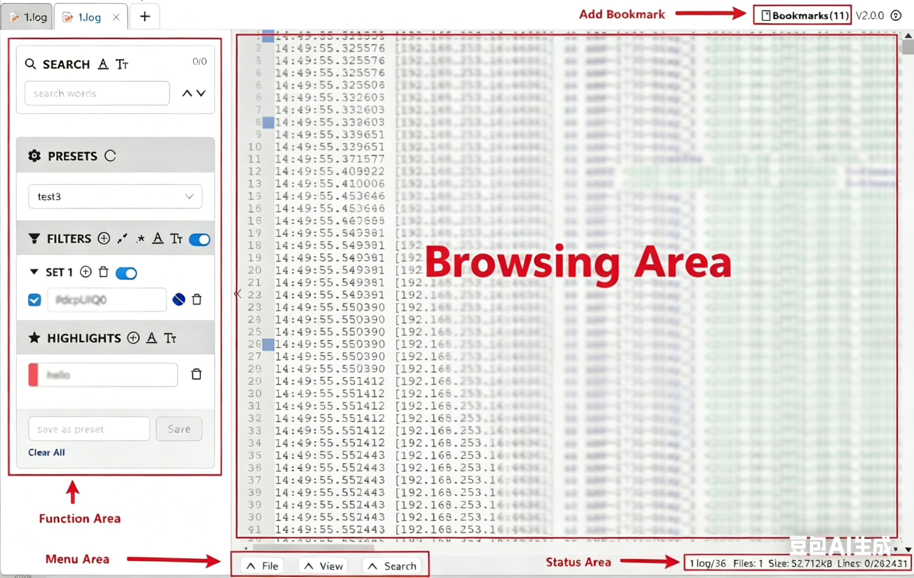
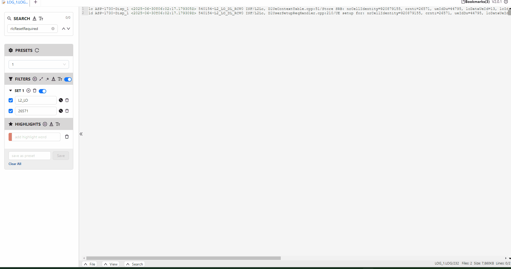

# Logbrowser

### Introduction
Logbrowser is a powerful log viewing tool that supports features such as log merging, searching, filtering, highlighting, bookmarking, and importing/exporting. It also supports configuration persistence and bulk importing/exporting of multiple files, making it ideal for troubleshooting and analysis of large-scale software systems. Compared to Notepad++, it offers greater flexibility and more robust functionality.

### UI Layout

### Operation Demo

### Features
1.Supports regular expressions, wildcards, whole-word matching, and case-sensitive search and filtering. 
2.Supports up to 6 filter sets. Each set can contain up to 8 keywords. The relationship between different filter sets is "OR", while the relationship between keywords within a single set is "AND". 
3.Supports dynamic switching of different background colors for highlighting. 
4.Supports two types of bookmarks: implicit bookmarks added by clicking the line header, and explicit bookmarks added via the GUI. 
5.Supports zoom in and zoom out.

### Common Shortcuts
**Ctrl+C:** Copy  
**Ctrl+V:** Paste  
**Ctrl+O:** Open multiple files 
**Ctrl+K:** Open folder 
**Ctrl+S:** Save as... 
**Ctrl+ Mouse Wheel Up:** Zoom in 
**Ctrl+ Mouse Wheel Down:** Zoom out 
**PageUp or UpArrow:** Page up 
**PageDown or DownArrow:** Page down 
**Home or LeftArrow:** Jump to the beginning of the line 
**End or RightArrow:** Jump to the end of the line 
**Click line numer:** Add bookmark 
**F2 or Shitf + F2:** Navigate to previous/next bookmark 
**Ctrl+Shift+F2:** Clear all bookmarks 
